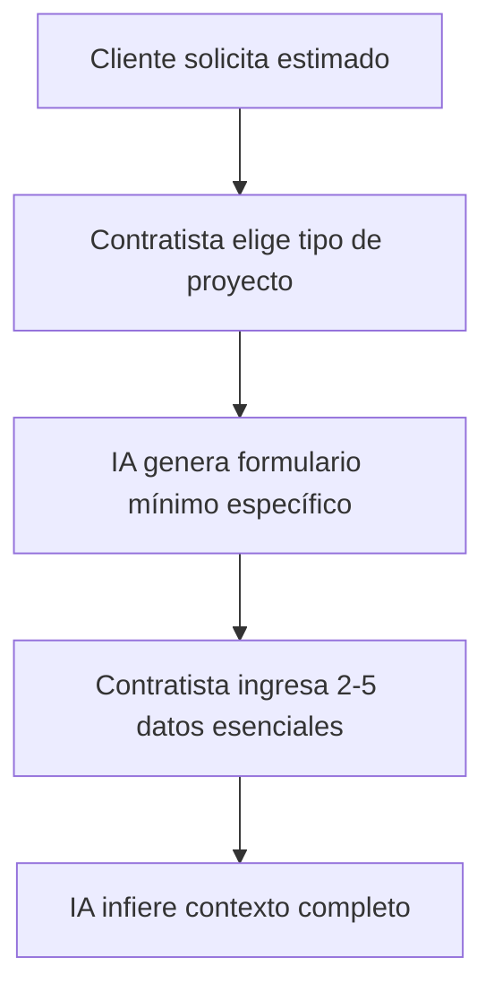
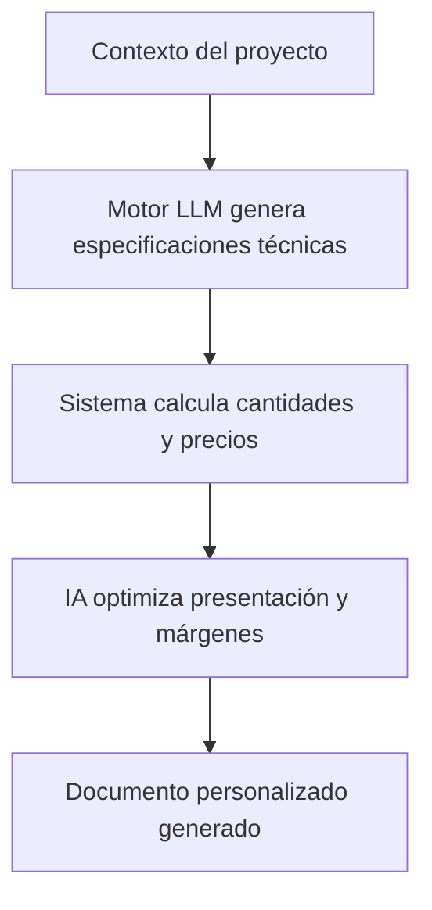
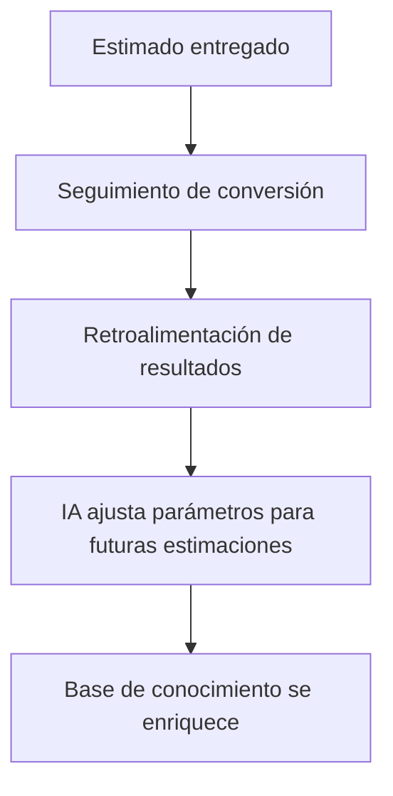

# Arquitectura Revolucionaria de Owl Fence Estimator

## Enfoque de IA Adaptativa vs. Base de Datos Estática

### El Problema Tradicional
Los sistemas tradicionales de estimación dependen de bases de datos estáticas, pre-programadas con:
- Catálogos específicos de materiales por industria
- Reglas rígidas de cálculo por tipo de proyecto
- Precios que requieren actualización manual
- Flujos de trabajo diseñados para casos ideales

### Nuestra Solución Disruptiva
Owl Fence Estimator utiliza un enfoque revolucionario de **IA Adaptativa Multi-Industria** que:
- Genera conocimiento especializado bajo demanda
- Adapta su razonamiento a cada tipo de contratista
- Mejora con cada estimado para mayor precisión
- Elimina la necesidad de bases de datos exhaustivas pre-construidas

## Componentes Clave de la Arquitectura

### 1. Motor LLM Especializado para Contratistas
- **Modelo Base**: LLM de última generación (GPT-4 o superior)
- **Fine-tuning por Industria**: Modelos específicos para fencing, roofing, flooring, etc.
- **Entrenamiento Continuo**: Mejora automática con cada estimado generado
- **Contextualización Dinámica**: Integración de conocimiento local y tendencias de mercado

### 2. Sistema de Recopilación Mínima de Datos
- **Formularios Inteligentes**: Adaptados en tiempo real según tipo de proyecto
- **Preguntas Críticas**: Solo las esenciales (2-5) para generar un estimado básico
- **Expansión Contextual**: Generación de detalles adicionales por la IA
- **Interfaz Conversacional**: Obtención natural de datos mediante diálogo

### 3. Generador de Conocimiento Técnico
- **Síntesis de Información**: Combinación de datos públicos sobre materiales y técnicas
- **Validación Cruzada**: Verificación de coherencia técnica de cada estimado
- **Base de Conocimiento Emergente**: Estructura que crece y mejora con cada uso
- **Adaptación Regional**: Ajuste a prácticas locales y disponibilidad de materiales

### 4. Motor de Cálculo Flexible
- **Algoritmos Generativos**: Creación dinámica de fórmulas de cálculo por proyecto
- **Razonamiento por Analogía**: Uso de proyectos similares como referencia
- **Verificadores de Coherencia**: Validación de cantidades y costos
- **Ajuste de Márgenes Inteligente**: Optimización para maximizar competitividad y rentabilidad

### 5. Sistema Universal de Estimados
Los componentes esenciales universales para cualquier estimado:
- **Información del Contratista**: Logo, datos de contacto, licencias, etc.
- **Información del Cliente**: Contacto y ubicación del proyecto
- **Materiales**: Cantidades, precios unitarios y totales
- **Servicios**: Descripción, alcance y costos
- **Términos y Condiciones**: Personalizados pero legalmente sólidos

## Flujo de Trabajo Revolucionario

### Fase 1: Captura Mínima e Inteligente


### Fase 2: Generación Adaptativa


### Fase 3: Aprendizaje Continuo


## Ventajas Revolucionarias

### 1. Eliminación de Barreras de Entrada
- Sin necesidad de crear bases de datos por industria
- Aplicación universal para cualquier tipo de contratista
- Escalable a nuevas industrias sin rediseño

### 2. Precisión Emergente
- Mayor precisión con cada uso
- Adaptación a las peculiaridades de cada contratista
- Verificación cruzada con datos de mercado

### 3. Eficiencia Exponencial
- De horas a segundos en la generación de estimados
- Posibilidad real de generar 100+ estimados diarios
- Eliminación de tareas manuales repetitivas

### 4. Ventaja Competitiva Total
- Respuesta inmediata a clientes potenciales
- Profesionalismo superior en presentación
- Mayor tasa de conversión por rapidez y precisión

## Implementación Técnica

### Arquitectura del Sistema
```
┌─────────────────┐     ┌──────────────────┐     ┌─────────────────┐
│    Frontend     │────▶│ API Orquestadora │────▶│  Motor de IA    │
│  React/NextJS   │◀────│     Express      │◀────│  Fine-tuned LLM │
└─────────────────┘     └──────────────────┘     └─────────────────┘
                               │  ▲                      │  ▲
                               ▼  │                      ▼  │
                        ┌──────────────────┐     ┌─────────────────┐
                        │ Gestor de Datos  │     │Base Conocimiento│
                        │     MongoDB      │◀───▶│  Vector Store   │
                        └──────────────────┘     └─────────────────┘
```

### Stack Tecnológico Recomendado
- **Frontend**: React/Next.js con TailwindCSS
- **Backend**: Node.js (NestJS) + Express
- **Base de Datos**: MongoDB (datos) + Pinecone (vectores)
- **IA**: OpenAI API + Modelos Fine-tuned propios
- **PDF**: React-PDF para generación de documentos
- **DevOps**: Docker + AWS/Vercel para escalabilidad

## Plan de Implementación Ágil

### Fase 1: MVP Enfocado (4-6 semanas)
- Desarrollar motor DeepSearch unificado con capacidad para analizar proyectos de cercas (fencing)
- Implementar generación de estimados para los 3-5 tipos de cercas más comunes usando un único motor de IA
- Crear interfaz mínima funcional con flujo completo

### Fase 2: Expansión y Optimización (6-8 semanas)
- Expandir el motor DeepSearch para soportar 2-3 industrias adicionales (roofing, flooring) sin crear motores separados
- Implementar sistema de aprendizaje y retroalimentación para mejorar precisión del motor unificado

### Fase 3: Escalabilidad y Mercado (8-12 semanas)
- Arquitectura distribuida para soportar alta demanda
- Implementación de panel administrativo para contratistas
- Lanzamiento al mercado con plan de adopción gradual

## Conclusión

Owl Fence Estimator no será simplemente un software más para contratistas - será una revolución en la forma en que se generan estimados, eliminando barreras técnicas y permitiendo a cualquier contratista competir con la eficiencia de grandes empresas.

En lugar de intentar resolver la complejidad creando enormes bases de datos estáticas, abordamos el problema con inteligencia adaptativa que aprende y evoluciona, transformando un proceso tradicionalmente complejo en uno simple, rápido y extraordinariamente preciso.